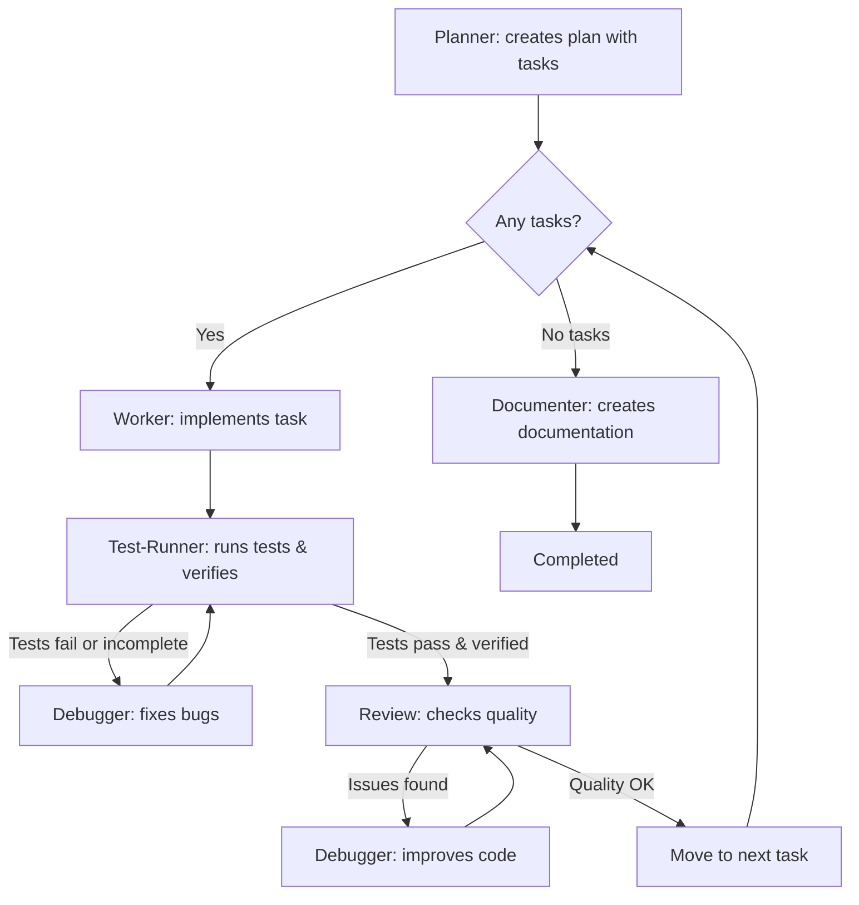

# Orchestration Workflow Skill

**Purpose**: Orchestrate complete development cycle - from planning to documentation with automatic error fixing.

## When to Use

- User types `/orchestrate [task]`
- Complex tasks requiring planning and breakdown
- Multi-step implementations
- Tasks that need thorough testing and review

## Workflow Architecture



## How It Works

### Phase 1: Planning

1. Call **planner** with the full task description
2. Planner creates:
   - Workspace: `.cursor/workspace/active/orch-{id}/`
   - Plan file: `workspace/plan.md` OR uses user's file
   - Metadata: `progress.json`, `tasks.json`, `links.json`
3. Planner returns orchestration ID

### Phase 2: Load Orchestration

**Read configuration:**
```javascript
config = readJSON(".cursor/config.json") || defaultConfig
workspacePath = config.workspace.path
```

**Load orchestration state:**
```javascript
orchestrationId = userInput || findLatestActive()
workspaceDir = `${workspacePath}/active/${orchestrationId}`

progress = readJSON(`${workspaceDir}/progress.json`)
tasksState = readJSON(`${workspaceDir}/tasks.json`)
links = readJSON(`${workspaceDir}/links.json`)

// Read plan from documentation
planContent = read(links.plan)
taskIds = extractTaskIds(planContent)
```

### Phase 3: Task Loop

**CRITICAL**: Iterate through ALL tasks.

For EACH task ID from plan:

**Before starting task:**
```javascript
// Skip if already completed
if (tasksState[taskId]?.status === "completed") continue

// Update task status: pending → in-progress
tasksState[taskId] = {
  id: taskId,
  status: "in-progress",
  startedAt: now()
}
write(`${workspaceDir}/tasks.json`, tasksState)

// Update plan file
updateTaskInPlan(links.plan, taskId, "🔄 In Progress")

// Update orchestration progress
updateJSON(`${workspaceDir}/progress.json`, {
  currentTask: taskId,
  lastUpdated: now()
})
```

**During task:**

#### Step 1: Implementation
- Call **worker** with current subtask
- Wait for completion
- Extract what was created
- (Hook auto-fixes formatting in background)

#### Step 2: Linting + Testing + Verification
- Call **test-runner** to verify code quality, functionality, and completeness
- Test-runner checks:
  - Linter (code quality, style issues)
  - Tests (functionality verification)
  - Verification (acceptance criteria met, implementation complete)
- **If tests fail or verification incomplete**:
  - Call **debugger** to fix issues or complete missing parts
  - Re-run **test-runner**
  - Max 3 retry attempts

#### Step 3: Code Review
- Call **reviewer** to check code quality
- **If reviewer finds problems**:
  - Call **debugger** to improve code
  - Re-run **reviewer**
  - Max 3 retry attempts

#### Step 4: Update Task Status

**After test-runner verifies and reviewer approves:**

```javascript
// Update task status: in-progress → completed
tasksState[taskId] = {
  ...tasksState[taskId],
  status: "completed",
  completedAt: now(),
  filesChanged: result.filesChanged,
  testsRun: testResult.total,
  testsPassed: testResult.passed
}
write(`${workspaceDir}/tasks.json`, tasksState)

// Update plan file
updateTaskInPlan(links.plan, taskId, "✅ Completed")

// Update orchestration progress
updateJSON(`${workspaceDir}/progress.json`, {
  tasksCompleted: progress.tasksCompleted + 1,
  currentTask: null,
  lastUpdated: now()
})
```

**OLD approach (deprecated):**
1. **Update task file:**
```markdown
File: ai_docs/develop/tasks/AUTH-001-user-model.md

Update:
- Status: 🔄 In Progress → ✅ Completed
- Add: Completed: 2026-02-10 15:30
- Add: Time taken: 30 minutes
- Add: Files changed: src/models/User.ts, ...
- Add: Tests: 5/5 passed
- Add: Issues created: ISS-001 (if any)
```

2. **Update plan file:**
```markdown
File: ai_docs/develop/plans/2026-02-10-auth-system.md

Update Progress section:
- ✅ AUTH-001: Completed (15:30, 30 min)
- 🔄 AUTH-002: In Progress
- ⏳ AUTH-003: Pending
```

3. **Move to next task**
```javascript
// Automatically continues to next task in loop
nextTaskId = taskIds[currentIndex + 1]
// REPEAT cycle (Steps 1-5) for next task
```

### Phase 4: Finalization

**After all tasks complete:**

```javascript
// Update orchestration status
updateJSON(`${workspaceDir}/progress.json`, {
  status: "documenting",
  lastUpdated: now()
})

// Call documenter to create final report
reportFile = callDocumenter({
  orchestrationId: progress.id,
  planFile: links.plan,
  tasksState: tasksState
})

// Save report link
updateJSON(`${workspaceDir}/links.json`, {
  report: reportFile
})

// Mark orchestration as completed
updateJSON(`${workspaceDir}/progress.json`, {
  status: "completed",
  completedAt: now(),
  reportFile: reportFile
})

// Archive workspace
move(
  `${workspacePath}/active/${orchestrationId}`,
  `${workspacePath}/completed/${orchestrationId}`
)
```

## Important Rules

### Sequential Execution
- Wait for each agent to complete before calling next
- Pass context from previous agent to next
- Track state across the entire workflow

### Error Handling
- Automatic retry with debugger on failures
- **Max 3 retry attempts per stage** (test/review)
- If max attempts reached, report to user and ask for guidance

### Task Limits
- **Recommended max: 10 tasks per orchestration cycle**
- If Planner creates more than 10 tasks:
  - Complete first 10 tasks
  - Report progress to user
  - Ask if should continue with remaining tasks
- **Max task execution time: check context window usage**
- If approaching context limit, save progress and ask user

### Task Tracking
- Keep track of completed vs pending tasks
- Show progress after each task completion (e.g., "Task 3/7")
- Show estimated remaining tasks
- Final summary lists all accomplished work

### Context Management
- Each agent gets context about what previous agents did
- Debugger gets specific error details to fix
- Documenter gets full picture of all changes

## Example Usage

User says: `/orchestrate Build user authentication with email/password and OAuth`

Your response:

```markdown
I'll orchestrate the full development cycle for this complex task.

**Task**: Build user authentication with email/password and OAuth

### Phase 1: Planning
[Call planner to break down into subtasks]

[Wait for planner result - extract tasks]

**Plan created:**
1. Database schema for users
2. Email/password authentication
3. OAuth integration (Google, GitHub)
4. Session management
5. Protected routes middleware

### Phase 2: Implementation Cycle

**Task 1/5: Database schema for users**
- [Call worker]
- [Call test-runner for tests & verification]
- [If failed: call debugger and retry]
- [Call reviewer]
- [If issues: call debugger and retry]
- ✅ Task 1 complete

**Task 2/5: Email/password authentication**
...

[Continue for all tasks]

### Phase 3: Documentation
[Call documenter with all changes]

### Summary
✅ All 5 tasks completed
✅ Tests passing
✅ Code reviewed
✅ Documentation created

Files changed: [list]
Documentation: [list]
```

## Retry Logic

### Test/Verification Failures
```
test-runner → FAIL → debugger → test-runner
  ↓ (max 3 attempts)
  ↓
  If still failing: report to user
```

### Review Issues
```
review → PROBLEMS → debugger → review
  ↓ (max 3 attempts)
  ↓
  If still issues: report to user
```

## Trigger Phrases

- `/orchestrate [task]`
- "Orchestrate [X]"
- "Full implementation of [Y]"

## When to Use This vs Simple Workflow

| Use `/implement` | Use `/orchestrate` |
|-----------------|---------------------|
| Single component | Full feature |
| One file change | Multiple modules |
| No planning needed | Needs breakdown |
| Quick task | Complex project |

## Key Features

1. **Automatic Planning**: Breaks complex tasks into manageable pieces
2. **Auto-fixing**: Debugger automatically fixes test/review failures
3. **Quality Gates**: Every task goes through test-runner (with verification) → reviewer
4. **Progress Tracking**: See which tasks are done, which are pending
5. **Comprehensive Docs**: Full documentation after all work complete

## Example Tasks

Good for `/orchestrate`:
- Build authentication system
- Create admin dashboard with CRUD
- Implement payment integration
- Migrate database schema
- Refactor major module with tests

Bad for `/orchestrate` (use `/implement`):
- Add one function
- Fix simple bug
- Create single component
- Update one file

## Success Criteria

Workflow is complete when:
- ✅ All planned tasks implemented
- ✅ All tests passing
- ✅ Code review approved
- ✅ All acceptance criteria verified (by test-runner)
- ✅ Documentation created

## Notes

- This skill replaces hook-based orchestration
- All execution happens in same chat, visible to user
- User can intervene at any point if needed
- Debugger is only called when there are actual errors/issues
- Max 3 retry attempts prevents infinite loops
