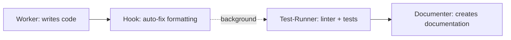

# Simple Workflow Skill

**Purpose**: Run worker → test-runner → documenter in sequence for simple tasks.

## When to Use

- User types `/implement [task]`
- User wants to create code with automatic testing and documentation
- Simple, single-purpose tasks that don't need planning

## How It Works

### Workflow: Code → (Auto-fix) → Lint + Test → Docs



1. **Worker** creates the code
2. **Hook** (automatic, background) auto-fixes formatting (prettier, eslint --fix)
3. **Test-Runner** runs linter checks + tests to verify it works
4. **Documenter** creates documentation in configured docs path

All agent steps visible in the same chat. Hook runs in background.

## Example Usage

User says: `/implement Create a Button component with onClick handler`

You should:

```markdown
I'll implement this in three steps: code, test, and document.

### Step 1: Implementation
[Call Task with subagent_type="worker"]

### Step 2: Testing  
[After worker finishes, call Task with subagent_type="test-runner"]

### Step 3: Documentation
[After tests pass, call Task with subagent_type="documenter"]

### Summary
All steps completed!
- Worker created: [list files]
- Tests: [status]
- Documentation: [list docs]
```

## Important Rules

1. **Sequential execution**: Wait for each agent to complete before calling the next
2. **Always run all three steps**: worker → test-runner → documenter
3. **Same chat**: All happens in current conversation, visible to user
4. **Pass context forward**: Tell each agent what the previous one did

## Code Pattern

```
Step 1: Call worker with task description
  → Wait for result
  → Extract files created

Step 2: Call test-runner
  → "Run tests for files: [list from step 1]"
  → Wait for result
  → Check if tests passed

Step 3: Call documenter
  → "Document the implementation: [details from step 1]"
  → Wait for result
  → Compile final summary
```

## Trigger Phrases

- `/implement [task]`
- "Implement [X]"
- "Create [Y] with tests and docs"

## When NOT to Use

- **Complex tasks**: Use `/orchestrate` instead (includes planning)
- **Multiple subtasks**: Use `/orchestrate` for task breakdown
- **Need review/refactor**: Use full cycle workflow

## Key Difference from Full Cycle

| Simple Workflow | Full Cycle (/orchestrate) |
|----------------|---------------------------|
| No planning | Starts with planner |
| Single pass | Multiple tasks from plan |
| No review | Includes code review |
| No debugger loops | Auto-fixes with debugger |
| Quick and simple | Comprehensive and thorough |

## Benefits

- ✅ Fast for simple tasks
- ✅ Always includes tests
- ✅ Always creates documentation
- ✅ Everything visible in one chat
- ✅ No planning overhead

## Example Tasks

Good for `/implement`:
- Create a utility function
- Add a React component
- Implement an API endpoint
- Add a new feature to existing file

Not good for `/implement` (use `/orchestrate`):
- Build entire authentication system
- Refactor multiple modules
- Migrate database schema
- Implement complex feature with multiple parts
