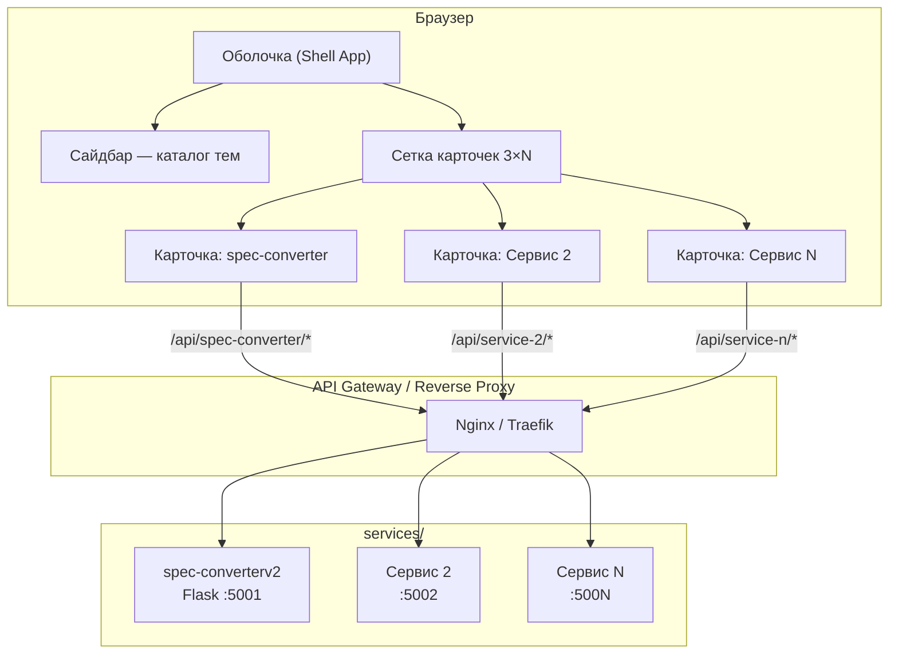
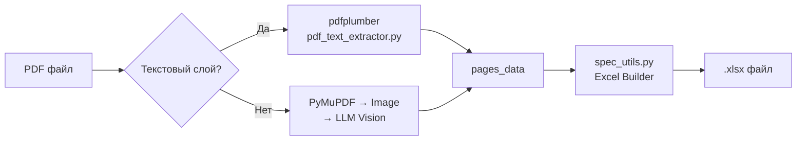

# Extraction Specific PDF — Мультисервисная платформа

> **Версия документа:** 1.2  
> **Дата:** 2026-02-18  
> **Статус:** Архитектурные решения приняты, один микросервис реализован

---

## 1. Обзор проекта

### 1.1 Назначение

Мультисервисная платформа (multiservice) с единым веб-интерфейсом для автоматизации офисных задач. Платформа объединяет независимые микросервисы, каждый из которых представлен как отдельное drag-and-drop окно в интерфейсе.

### 1.2 Ключевая идея

- **Единая оболочка** — веб-интерфейс с сайдбаром-каталогом тем и сеткой карточек (3 в ряд, ≥ 6 на экран).
- **Микросервисная архитектура** — каждый сервис автономен: собственный бэкенд, фронтенд-компонент, API, хранилище.
- **Plug-and-play** — новые сервисы подключаются без модификации оболочки.

### 1.3 Целевая аудитория

Инженеры-проектировщики, сметчики, специалисты по документообороту в строительных и проектных организациях (РФ).

---

## 2. Архитектура

### 2.1 Высокоуровневая схема



### 2.2 Компоненты системы

| Компонент | Описание | Технологии |
|-----------|----------|------------|
| **Shell App** | Единая оболочка, SPA | Vanilla JS + Web Components (Custom Elements) |
| **API Gateway** | Маршрутизация, CORS, rate limiting | Nginx (path-based routing) |
| **Service Registry** | Реестр сервисов, метаданные | JSON-манифесты, динамическая загрузка |
| **Микросервис N** | Автономный сервис (Dual mode) | Любой стек (Python/Node/Go) |

### 2.3 Принципы архитектуры

1. **Независимость сервисов** — каждый сервис деплоится, масштабируется и обновляется независимо.
2. **Единый контракт** — все сервисы регистрируются через общий манифест (название, иконка, описание, endpoint, категория).
3. **Изоляция отказов** — падение одного сервиса не влияет на оболочку и другие сервисы.
4. **Dual mode** — каждый сервис работает как автономно (свой `index.html`), так и встроенно в оболочку (Web Component).
5. **Безопасность по умолчанию** — валидация входных данных на каждом уровне, CORS через Gateway, ограничение размера файлов.
6. **Stateless** — нет централизованной БД; история операций в `localStorage` браузера.

---

## 3. Оболочка (Shell App)

### 3.1 Интерфейс

```
┌──────────────────────────────────────────────────────────┐
│  HEADER: Логотип / Название платформы           [Поиск]  │
├──────────┬───────────────────────────────────────────────┤
│          │  ┌────────┐  ┌────────┐  ┌────────┐          │
│ САЙДБАР  │  │ Сервис │  │ Сервис │  │ Сервис │          │
│          │  │   1    │  │   2    │  │   3    │          │
│ Категории│  └────────┘  └────────┘  └────────┘          │
│          │  ┌────────┐  ┌────────┐  ┌────────┐          │
│ ▸ Все    │  │ Сервис │  │ Сервис │  │ Сервис │          │
│ ▸ Конвер-│  │   4    │  │   5    │  │   6    │          │
│   теры   │  └────────┘  └────────┘  └────────┘          │
│ ▸ Отчёты │                                               │
│ ▸ Утилиты│                                               │
│          │                                               │
└──────────┴───────────────────────────────────────────────┘
```

### 3.2 Карточка сервиса (Web Component)

Каждый сервис оформляется как Custom Element (`<service-card-{id}>`). Карточка содержит:
- Иконку / миниатюру
- Название сервиса
- Краткое описание (1-2 строки)
- Зону drag-and-drop для загрузки файла (если сервис поддерживает)
- Индикатор статуса сервиса (online / offline — по `/health`)
- Badges: 👁 (Vision fallback), красная подсветка (ошибка)
- Кнопку действия

Shadow DOM обеспечивает изоляцию стилей между сервисами.

### 3.3 Взаимодействие (Quick + Advanced)

**Quick mode (drag-and-drop на карточку):**
1. Пользователь перетаскивает файл на карточку → обработка с дефолтными настройками.
2. Карточка показывает прогресс и результат.
3. Результат скачивается автоматически.

**Advanced mode (клик по заголовку):**
1. Карточка раскрывается (модалка / side-panel).
2. Доступны: drag-and-drop, выбор провайдера, просмотр логов, кнопка «Только Vision».
3. Предпросмотр результата перед скачиванием.

**Фильтрация:**
Пользователь выбирает категорию в сайдбаре → фильтрация карточек.

### 3.4 История операций

Последние 10 операций хранятся в `localStorage` браузера:
- Имя файла, дата, статус (успех / ошибка), использованный метод (text / vision).
- Обработанные файлы на сервере удаляются сразу после выдачи или через 1 час (cron).

---

## 4. Манифест сервиса (Service Manifest)

Каждый микросервис предоставляет манифест для регистрации в оболочке и JS-файл Web Component:

```json
{
  "id": "spec-converterv2",
  "name": "Конвертер спецификаций",
  "description": "PDF → Excel для проектных спецификаций (ВК, ОВ, ЭО)",
  "version": "2.0.0",
  "category": "converters",
  "icon": "file-spreadsheet",
  "component": "component.js",
  "accepts": ["application/pdf"],
  "endpoints": {
    "base": "/api/spec-converter",
    "convert": "POST /convert",
    "health": "GET /health"
  },
  "maxFileSize": "50MB",
  "outputType": "file-download",
  "outputMime": "application/vnd.openxmlformats-officedocument.spreadsheetml.sheet"
}
```

Поле `component` указывает на JS-файл в корне сервиса, экспортирующий Custom Element.
Shell App загружает его через `<script src="/services/{id}/component.js">` и рендерит тег `<service-card-{id}>`.

---

## 5. Микросервис: spec-converterv2 (существующий)

### 5.1 Назначение

Автоматическая конвертация PDF-спецификаций российской проектной документации (ВК, ОВ, ЭО и т.п.) в структурированный Excel-файл (.xlsx).

### 5.2 Стек

| Слой | Технология | Назначение |
|------|-----------|------------|
| Frontend | HTML/CSS/JS (статика) | Drag-and-drop, вызов API |
| Backend | Python 3.10+, Flask 3.0 | REST API, оркестрация |
| PDF → Text | pdfplumber | Извлечение текстового слоя |
| PDF → Image | PyMuPDF (fitz) | Рендеринг страниц |
| Vision (fallback) | Anthropic / OpenRouter / OpenAI | Извлечение таблиц из сканов |
| Excel | openpyxl | Генерация .xlsx |

### 5.3 Поток данных



### 5.4 API

| Метод | Endpoint | Описание |
|-------|----------|----------|
| `POST` | `/convert` | Загрузка PDF (multipart/form-data, поле `file`). Ответ: `.xlsx` или `{"error": "..."}` |
| `GET` | `/health` | Статус бэкенда и провайдера |

### 5.5 Ключевые алгоритмы

- **Маппинг колонок**: поиск строки-нумератора (1–9), приведение 16/18/22 сырых колонок к 9 логическим.
- **Кодировка**: исправление «битой» кириллицы CP1251 → UTF-8 (`fix_encoding()`).
- **Фильтрация**: отсечение строк штампа, рамки, вертикальных надписей.
- **Постобработка**: разъединение слипшихся ячеек, нормализация кавычек, тире, склейка типа и кода.
- **Имя листа**: автоматическое определение по кодам систем (В1-3, Т3, К1 и т.п.).

### 5.6 Метрики качества

- Совпадение с эталоном: **~90.6%** по ячейкам.
- Лист 4: **100%** совпадений.
- Расхождения: порядок строк, мелкое форматирование.

### 5.7 Структура файлов

```
services/spec-converterv2/
├── component.js                   # Web Component для встраивания в Shell
├── manifest.json                  # Манифест для регистрации в оболочке
├── Dockerfile
├── frontend/
│   └── index.html                 # Standalone-режим (для автономного использования)
├── backend/
│   ├── app.py                     # Flask: /convert, /health, process_pdf
│   ├── pdf_text_extractor.py      # Text-first пайплайн
│   ├── spec_utils.py              # Excel Builder + Data Extractor
│   ├── .env                       # API-ключи (не в репо)
│   ├── test_text_pipeline.py      # Тест на эталонном PDF
│   └── requirements.txt           # Python-зависимости
├── TEXT_FIRST_PIPELINE.md
├── README.md
├── QUICKSTART.md
├── switch_provider.sh
└── start.sh
```

---

## 6. Технологический стек платформы

### 6.1 Оболочка (Shell) — утверждённый стек

| Компонент | Технология | Обоснование |
|-----------|-----------|-------------|
| UI | Vanilla JS + Custom Elements | Нет зависимостей, нативная компонентная модель |
| Изоляция стилей | Shadow DOM | Стили сервисов не конфликтуют |
| CSS | CSS Grid + Custom Properties | Нативная сетка 3×N, темизация |
| Сборка | Не требуется (на начальном этапе) | Нативные ES-модули, `<script type="module">` |
| Reverse Proxy | Nginx (path-based) | `localhost/api/{service}/*` → порт сервиса |
| Контейнеризация | Docker Compose | Запуск всего стека одной командой |
| WSGI-сервер | Gunicorn (2-4 воркера) | Продакшн-ready для Flask |

### 6.2 Стандарты для микросервисов

| Требование | Описание |
|-----------|----------|
| Health endpoint | `GET /health` — обязательный, формат: `{"status": "ok", "service": "...", "version": "..."}` |
| Манифест | `manifest.json` в корне сервиса (`services/{id}/manifest.json`) |
| Логирование | stdout/stderr, JSON-формат для production |
| Ошибки | Единый формат: `{"error": "message", "code": "ERROR_CODE"}` |
| CORS | Настраивается через Gateway, не в каждом сервисе |
| Таймауты | Явные таймауты для внешних вызовов |
| Ограничение файлов | Максимальный размер задаётся в манифесте |

---

## 7. Безопасность

### 7.1 Текущие меры (spec-converterv2)

- Валидация расширения загружаемого файла.
- CORS через `flask-cors`.
- API-ключи в `config.py` (не в репозитории через `.gitignore`).
- Временные файлы удаляются после обработки.

### 7.2 Планируемые меры (платформа)

| Угроза | Мера |
|--------|------|
| Загрузка вредоносных файлов | Валидация MIME-типа, magic bytes, ограничение размера |
| API abuse | Rate limiting на Gateway (Nginx `limit_req`) |
| XSS | Content-Security-Policy, экранирование вывода |
| Path traversal | Нормализация путей, запрет `..` |
| Утечка секретов | `.env` файлы + `.env.example` в репо (без секретов) |
| DDoS | Ограничение concurrent uploads, очереди задач |
| Аутентификация | Zero-auth по умолчанию; Basic Auth через Nginx при необходимости |

---

## 8. Производительность

### 8.1 Текущие характеристики (spec-converterv2)

- Text-first: ~2-5 секунд на PDF (10-20 страниц).
- Vision fallback: ~30-60 секунд на страницу (зависит от провайдера).
- Узкое место: последовательная обработка страниц, синхронный Flask.

### 8.2 Планируемые оптимизации (по этапам)

**Этап 1 (MVP):**

| Область | Решение |
|---------|---------|
| WSGI | Gunicorn (2-4 sync workers) вместо Flask dev server |
| Файлы | Удаление временных файлов сразу после выдачи + cron (1 час) |

**Этап 2 (масштабирование):**

| Область | Решение |
|---------|---------|
| Task Queue | Celery + Redis: загрузка → `task_id` → polling статуса |
| Масштабирование | Горизонтальное через Docker replicas |
| Frontend | Lazy loading карточек |
| Мониторинг | Prometheus + Grafana для метрик сервисов |

---

## 9. Этапы разработки

### Фаза 1 — Оболочка и интеграция (MVP)

1. Проектирование и создание Shell App (HTML/CSS/JS).
2. Реализация сетки карточек (3×N) с drag-and-drop.
3. Реализация сайдбара с категориями.
4. Определение формата манифеста сервиса.
5. Интеграция `spec-converterv2` как первого сервиса.
6. Настройка Nginx как reverse proxy.

### Фаза 2 — Контейнеризация и DevOps

7. Dockerfile для каждого сервиса.
8. Docker Compose для всего стека.
9. Health checks и мониторинг.
10. CI/CD пайплайн (GitHub Actions).

### Фаза 3 — Расширение функциональности

11. Второй микросервис (из роадмапа: OCR / DOCX Merger / Project Validator).
12. Система уведомлений (progress, ошибки) — badges на карточках, toast-уведомления.
13. Очереди задач (Celery + Redis) для тяжёлых операций.
14. Логирование и observability.

### Фаза 4 — Продакшн

15. Basic Auth через Nginx (опционально, по потребности).
16. Rate limiting и защита.
17. Task Queue (Celery + Redis) для масштабирования.
18. Нагрузочное тестирование.

---

## 10. Структура проекта (целевая)

```
project-root/
├── docs/                              # Документация проекта
│   ├── project.md
│   ├── tasktracker.md
│   ├── changelog.md
│   └── qa.md
│
├── shell/                             # Оболочка (Shell App)
│   ├── index.html                     # Главная страница
│   ├── css/
│   │   └── styles.css                 # CSS Grid, Custom Properties, BEM
│   ├── js/
│   │   ├── app.js                     # Инициализация, роутинг
│   │   ├── service-registry.js        # Загрузка manifest.json, создание карточек
│   │   ├── card-grid.js               # Сетка карточек (Custom Element)
│   │   ├── sidebar.js                 # Категории и фильтрация
│   │   └── history.js                 # LocalStorage: последние 10 операций
│   └── assets/
│       └── icons/
│
├── gateway/                           # Reverse Proxy
│   └── nginx.conf
│
├── services/                          # Все микросервисы
│   ├── spec-converterv2/              # Микросервис 1 (существующий)
│   │   ├── component.js               # Web Component для встраивания в Shell
│   │   ├── manifest.json              # Манифест для регистрации в оболочке
│   │   ├── Dockerfile
│   │   ├── frontend/
│   │   │   └── index.html             # Standalone-режим
│   │   ├── backend/
│   │   │   ├── .env                   # API-ключи (не в репо)
│   │   │   └── ...
│   │   └── ...
│   │
│   └── <service-n>/                   # Будущие сервисы (аналогичная структура)
│       ├── component.js
│       ├── manifest.json
│       ├── Dockerfile
│       └── ...
│
├── docker-compose.yml                 # Оркестрация всех сервисов
├── .env.example                       # Шаблон переменных окружения (без секретов)
├── .gitignore
└── README.md
```

---

## 11. Соглашения и стандарты

### 11.1 Именование

- Директории сервисов: `kebab-case` внутри `services/` (например `services/spec-converterv2`).
- Python: PEP 8, snake_case.
- JS: camelCase для переменных, PascalCase для классов.
- CSS: BEM-нотация (`block__element--modifier`).

### 11.2 Git

- Ветки: `feature/{service}/{description}`, `fix/{service}/{description}`.
- Коммиты: Conventional Commits (`feat:`, `fix:`, `docs:`, `chore:`).
- `.gitignore`: `config.py`, `.env`, `venv/`, `__pycache__/`, `uploads/`, `output/`.

### 11.3 Документация

- Каждый сервис содержит собственный `README.md`.
- Общая документация — в `/docs/`.
- API-документация — в манифесте + docstrings в коде.

---

## 12. Роадмап сервисов

| Сервис | Категория | Описание | Приоритет |
|--------|-----------|----------|-----------|
| spec-converterv2 | Конвертеры | PDF → Excel для проектных спецификаций | Реализован |
| Image-to-Text (OCR) | Конвертеры | Извлечение текста из фото штампов чертежей | Планируется |
| DOCX Merger | Генераторы документов | Сборка ПЗ (пояснительной записки) из кусков по шаблону | Планируется |
| Project Validator | Проверка / Нормоконтроль | Проверка соответствия шифров в именах файлов и внутри PDF | Планируется |

**Категории сайдбара:** Конвертеры, Проверка / Нормоконтроль, Генераторы документов.

---

## 13. Стратегия тестирования

### 13.1 Snapshot Testing (основной подход)

- Папка `gold_standard/` с парами `input.pdf` / `expected.json`.
- Тест сравнивает промежуточный JSON (выход `pdf_text_extractor`), а не Excel-файл.
- Порог прохождения: совпадение > 95%.

### 13.2 Unit-тесты

Ключевые функции для покрытия:
- `fix_encoding()` — кодировка CP1251 → UTF-8.
- `find_column_mapping()` — маппинг колонок.
- `normalize_table_to_9cols()` — нормализация таблиц.

### 13.3 E2E-тесты

На этапе интеграции в оболочку: загрузка файла через UI → получение результата.

---

## 14. Зависимости и совместимость

| Зависимость | Версия | Назначение |
|------------|--------|------------|
| Python | ≥ 3.10 | Бэкенд сервисов |
| Flask | 3.0.0 | REST API |
| pdfplumber | ≥ 0.10.0 | Извлечение текста из PDF |
| PyMuPDF | 1.23.8 | PDF → Image |
| openpyxl | 3.1.2 | Генерация Excel |
| anthropic | 0.39.0 | Vision API (Anthropic) |
| openai | 1.54.0 | Vision API (OpenAI/OpenRouter) |
| Docker | ≥ 24.0 | Контейнеризация |
| Nginx | ≥ 1.24 | Reverse Proxy |

---

*Документ обновляется при изменении архитектуры, добавлении сервисов или изменении технологических решений.*
